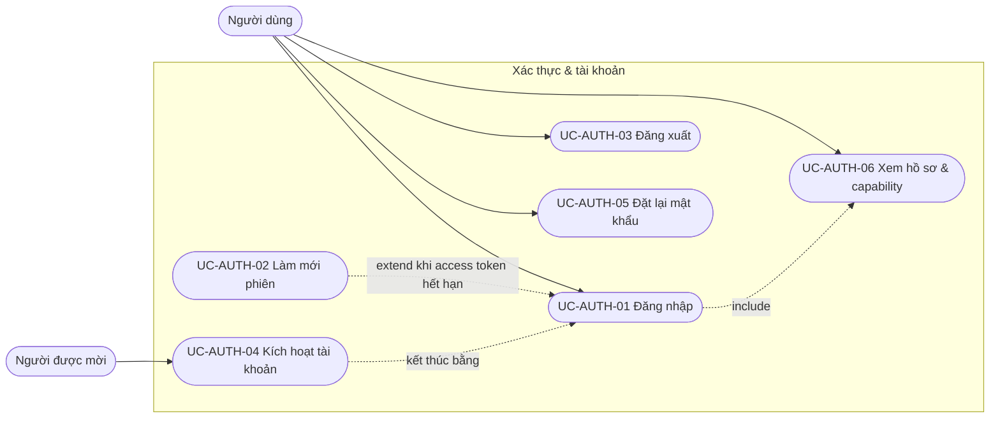
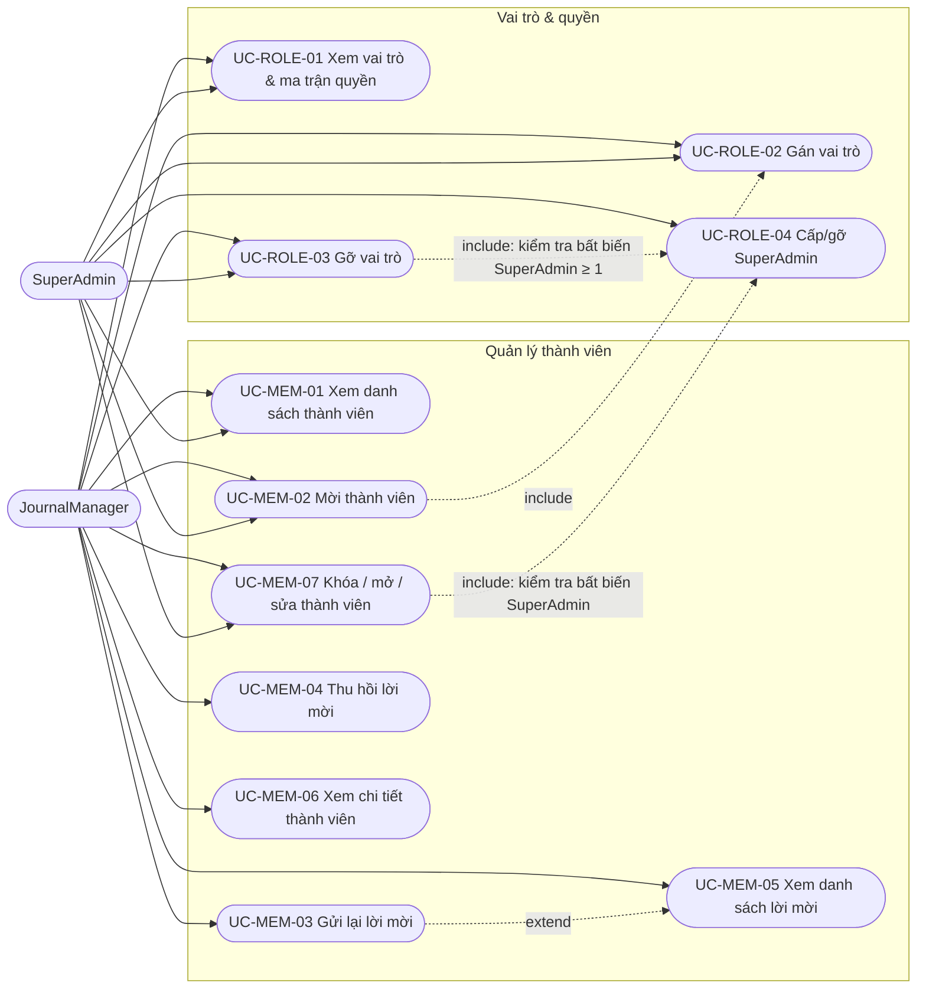

# 2.1.1 Use case – Xác thực, thành viên, vai trò

## Xác thực & tài khoản (UC-AUTH)

```mermaid
flowchart LR
    User([Người dùng])
    Invitee([Người được mời])
    subgraph AUTH["Xác thực & tài khoản"]
        A1(["UC-AUTH-01 Đăng nhập"])
        A2(["UC-AUTH-02 Làm mới phiên"])
        A3(["UC-AUTH-03 Đăng xuất"])
        A4(["UC-AUTH-04 Kích hoạt tài khoản"])
        A5(["UC-AUTH-05 Đặt lại mật khẩu"])
        A6(["UC-AUTH-06 Xem hồ sơ & capability"])
    end
    User --> A1
    User --> A3
    User --> A5
    User --> A6
    A1 -. "include" .-> A6
    A2 -. "extend khi access token hết hạn" .-> A1
    Invitee --> A4
    A4 -. "kết thúc bằng" .-> A1
```

## Thành viên & vai trò (UC-MEM, UC-ROLE)

```mermaid
flowchart LR
    JM([JournalManager])
    SA([SuperAdmin])
    subgraph MEM["Quản lý thành viên"]
        M1(["UC-MEM-01 Xem danh sách thành viên"])
        M2(["UC-MEM-02 Mời thành viên"])
        M3(["UC-MEM-03 Gửi lại lời mời"])
        M4(["UC-MEM-04 Thu hồi lời mời"])
        M5(["UC-MEM-05 Xem danh sách lời mời"])
        M6(["UC-MEM-06 Xem chi tiết thành viên"])
        M7(["UC-MEM-07 Khóa / mở / sửa thành viên"])
    end
    subgraph ROLE["Vai trò & quyền"]
        R1(["UC-ROLE-01 Xem vai trò & ma trận quyền"])
        R2(["UC-ROLE-02 Gán vai trò"])
        R3(["UC-ROLE-03 Gỡ vai trò"])
        R4(["UC-ROLE-04 Cấp/gỡ SuperAdmin"])
    end
    JM --> M1 & M2 & M3 & M4 & M5 & M6 & M7
    JM --> R1 & R2 & R3
    SA --> M1 & M2 & M7
    SA --> R1 & R2 & R3 & R4
    M2 -. "include" .-> R2
    M3 -. "extend" .-> M5
    R3 -. "include: kiểm tra bất biến SuperAdmin ≥ 1" .-> R4
    M7 -. "include: kiểm tra bất biến SuperAdmin" .-> R4
```
