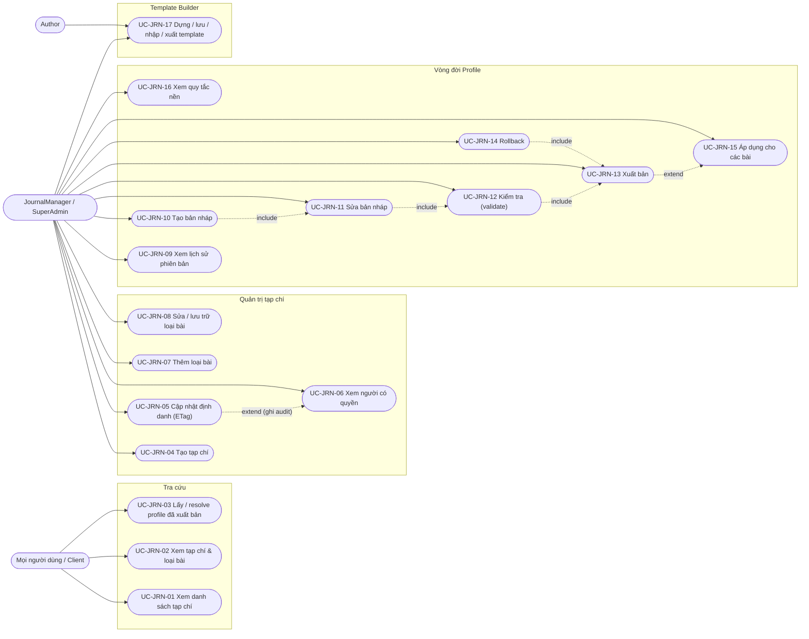

# 2.1.2 Use case – Tạp chí, loại bài, Profile, Template

```mermaid
flowchart LR
    Any([Mọi người dùng / Client])
    JM([JournalManager / SuperAdmin])
    Author([Author])

    subgraph VIEW["Tra cứu"]
        J1(["UC-JRN-01 Xem danh sách tạp chí"])
        J2(["UC-JRN-02 Xem tạp chí & loại bài"])
        J3(["UC-JRN-03 Lấy / resolve profile đã xuất bản"])
    end

    subgraph ADMIN["Quản trị tạp chí"]
        J4(["UC-JRN-04 Tạo tạp chí"])
        J5(["UC-JRN-05 Cập nhật định danh (ETag)"])
        J6(["UC-JRN-06 Xem người có quyền"])
        J7(["UC-JRN-07 Thêm loại bài"])
        J8(["UC-JRN-08 Sửa / lưu trữ loại bài"])
    end

    subgraph PROFILE["Vòng đời Profile"]
        J9(["UC-JRN-09 Xem lịch sử phiên bản"])
        J10(["UC-JRN-10 Tạo bản nháp"])
        J11(["UC-JRN-11 Sửa bản nháp"])
        J12(["UC-JRN-12 Kiểm tra (validate)"])
        J13(["UC-JRN-13 Xuất bản"])
        J14(["UC-JRN-14 Rollback"])
        J15(["UC-JRN-15 Áp dụng cho các bài"])
        J16(["UC-JRN-16 Xem quy tắc nền"])
    end

    subgraph TB["Template Builder"]
        J17(["UC-JRN-17 Dựng / lưu / nhập / xuất template"])
    end

    Any --> J1 & J2 & J3
    JM --> J4 & J5 & J6 & J7 & J8
    JM --> J9 & J10 & J11 & J12 & J13 & J14 & J15 & J16
    JM --> J17
    Author --> J17
    J10 -. "include" .-> J11
    J11 -. "include" .-> J12
    J12 -. "include" .-> J13
    J13 -. "extend" .-> J15
    J14 -. "include" .-> J13
    J5 -. "extend (ghi audit)" .-> J6
```
