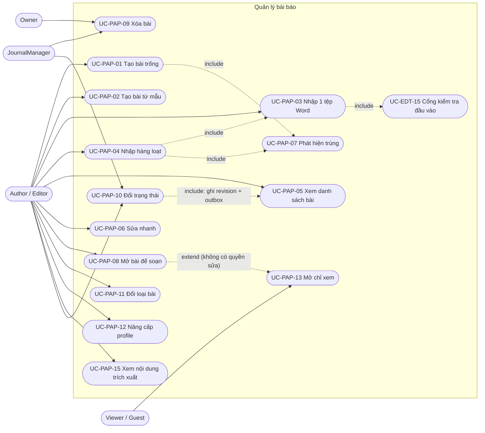
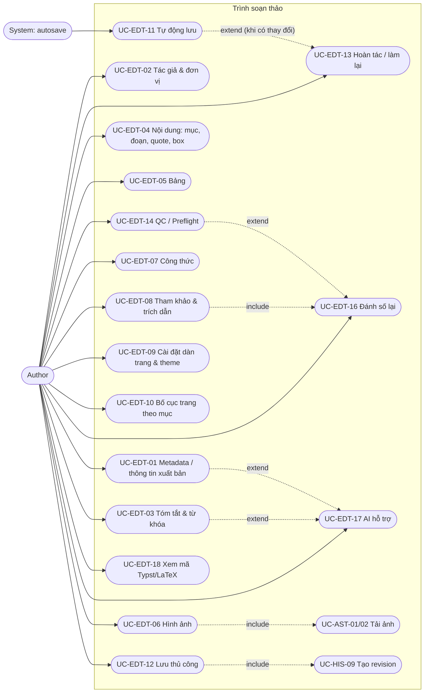

# 2.1.3 Use case – Quản lý bài báo & Soạn thảo

## Quản lý bài báo & nhập Word (UC-PAP)

```mermaid
flowchart LR
    Author([Author / Editor])
    Owner([Owner])
    Mgr([JournalManager])
    Viewer([Viewer / Guest])

    subgraph PAP["Quản lý bài báo"]
        P1(["UC-PAP-01 Tạo bài trống"])
        P2(["UC-PAP-02 Tạo bài từ mẫu"])
        P3(["UC-PAP-03 Nhập 1 tệp Word"])
        P4(["UC-PAP-04 Nhập hàng loạt"])
        P5(["UC-PAP-05 Xem danh sách bài"])
        P6(["UC-PAP-06 Sửa nhanh"])
        P7(["UC-PAP-07 Phát hiện trùng"])
        P8(["UC-PAP-08 Mở bài để soạn"])
        P9(["UC-PAP-09 Xóa bài"])
        P10(["UC-PAP-10 Đổi trạng thái"])
        P11(["UC-PAP-11 Đổi loại bài"])
        P12(["UC-PAP-12 Nâng cấp profile"])
        P13(["UC-PAP-13 Mở chỉ xem"])
        P15(["UC-PAP-15 Xem nội dung trích xuất"])
        EDT15(["UC-EDT-15 Cổng kiểm tra đầu vào"])
    end

    Author --> P1 & P2 & P3 & P4 & P5 & P6 & P8 & P11 & P12 & P15
    Owner --> P9
    Mgr --> P9 & P10
    Author --> P10
    Viewer --> P13
    P1 -. "include" .-> P7
    P3 -. "include" .-> EDT15
    P4 -. "include" .-> P3
    P4 -. "include" .-> P7
    P8 -. "extend (không có quyền sửa)" .-> P13
    P10 -. "include: ghi revision + outbox" .-> P5
```

## Soạn thảo (UC-EDT)

```mermaid
flowchart LR
    Author([Author])
    Sys([System: autosave])

    subgraph EDT["Trình soạn thảo"]
        E1(["UC-EDT-01 Metadata / thông tin xuất bản"])
        E2(["UC-EDT-02 Tác giả & đơn vị"])
        E3(["UC-EDT-03 Tóm tắt & từ khóa"])
        E4(["UC-EDT-04 Nội dung: mục, đoạn, quote, box"])
        E5(["UC-EDT-05 Bảng"])
        E6(["UC-EDT-06 Hình ảnh"])
        E7(["UC-EDT-07 Công thức"])
        E8(["UC-EDT-08 Tham khảo & trích dẫn"])
        E9(["UC-EDT-09 Cài đặt dàn trang & theme"])
        E10(["UC-EDT-10 Bố cục trang theo mục"])
        E11(["UC-EDT-11 Tự động lưu"])
        E12(["UC-EDT-12 Lưu thủ công"])
        E13(["UC-EDT-13 Hoàn tác / làm lại"])
        E14(["UC-EDT-14 QC / Preflight"])
        E16(["UC-EDT-16 Đánh số lại"])
        E17(["UC-EDT-17 AI hỗ trợ"])
        E18(["UC-EDT-18 Xem mã Typst/LaTeX"])
        AST(["UC-AST-01/02 Tải ảnh"])
        HIS(["UC-HIS-09 Tạo revision"])
    end

    Author --> E1 & E2 & E3 & E4 & E5 & E6 & E7 & E8 & E9 & E10 & E12 & E13 & E14 & E16 & E17 & E18
    Sys --> E11
    E6 -. "include" .-> AST
    E8 -. "include" .-> E16
    E14 -. "extend" .-> E16
    E12 -. "include" .-> HIS
    E11 -. "extend (khi có thay đổi)" .-> E13
    E3 -. "extend" .-> E17
    E1 -. "extend" .-> E17
```
